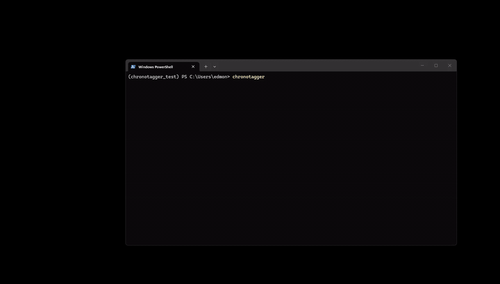
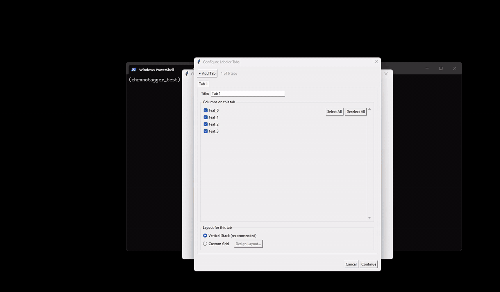
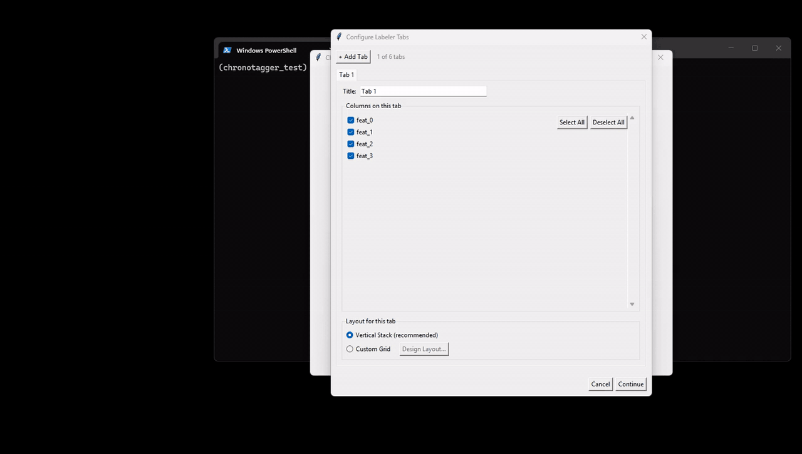
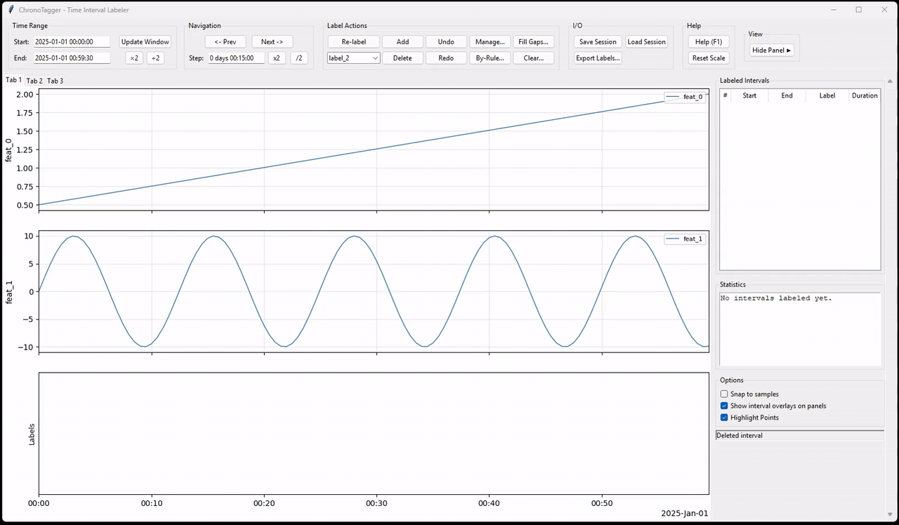
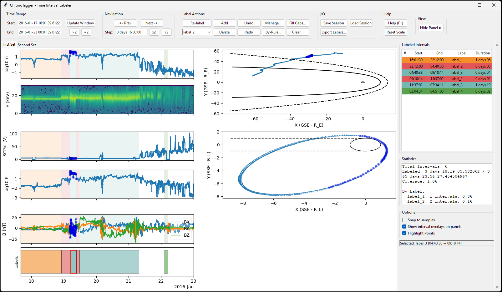
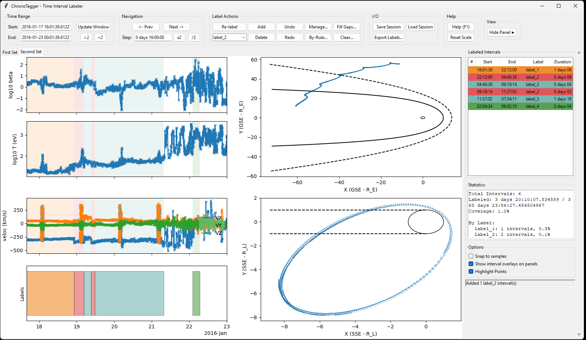
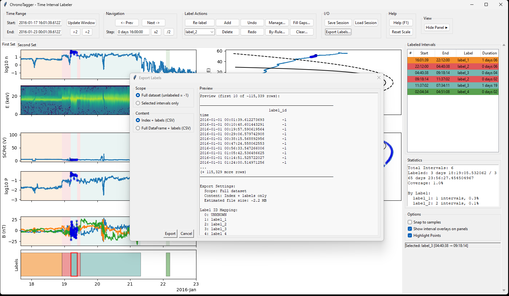

# ChronoTagger — Advanced Time-Series Interval Labeling Tool

[](https://github.com/jae1018/ChronoTagger/actions/workflows/tests.yml)
[](https://www.python.org/downloads/)
[](LICENSE)

ChronoTagger is a powerful, interactive GUI for labeling time intervals on matplotlib plots. Built for scientific data analysis, it provides a seamless workflow for annotating time-series data with ML-ready label exports. With temporal data, ChronoTagger can adapt to your custom plotting code.



*From a CSV to labeled intervals in under a minute. `chronotagger` launches a guided wizard that handles file loading, column selection, layout, and the labeling UI.*

## Key Features

- **Works with your matplotlib code** - Bring your own plot functions
- **Interactive layout builder** - Visually design multi-panel layouts without coding  
- **Mixed plot types** - Combine time-series with position/phase-space plots
- **Multiple selection modes** - Drag, two-click, or box selection with snap-to-samples
- **Rule-based labeling** - Apply labels using data conditions (AND/OR logic)
- **Flexible label assignment** - Fill gaps with any label via dialog
- **Overlap resolution** - Smart handling when selections overlap existing intervals
- **ML-ready exports** - Integer labels with JSON mapping for direct model training
- **Performance optimized** - PolyCollection overlays for 10-30× faster rendering
- **Gesture-level undo/redo** - One undo step per user action, however many intervals it touched
- **Professional label management** - Add, rename, recolor, reorder, reassign labels

## See it in action

### Multi-tab labeling



Configure several tabs of plots in one wizard pass — each with its own column selection and layout — then label across them. Intervals stay synchronized: a label drawn on tab 1's strip shows up on tab 2's strip too.

### Custom grid designer



For layouts the vertical-stack default doesn't cover, drop into the visual grid designer. Drag panels onto cells, switch a panel from time-series to cross-plot, pick its X/Y columns from dropdowns. The output is the same `layout_spec` dict you'd write by hand — without writing it.

### Rule-based labeling



Skip the click-and-drag for systematic patterns: type `feat_1 >= 0`, hit Preview, see every matching span on screen, then commit. Combine multiple conditions with AND/OR, choose how to resolve overlaps with already-labeled intervals (skip vs replace), and apply to the current window or the entire dataset.

## Quick Start

### Option 1 — GUI wizard (no code)

After installing (see below), launch the wizard from any terminal:

```bash
chronotagger
```

The wizard walks you through file loading (CSV/Parquet), column selection, layout configuration, and drops you straight into the labeler. No Python required.

### Option 2 — Python API

For custom plot functions (e.g. spectrograms, multi-trace overlays, domain-specific overlays), construct the labeler directly:

```python
import pandas as pd
from chronotagger import TimeIntervalLabeler

# Your data (DataFrame with DatetimeIndex)
df = pd.read_csv("data.csv", index_col=0, parse_dates=True)

# Your custom plot function -- panel keys must match layout_spec.areas[*].key
def plot_fn(axs, df, t0, t1):
    axs["panel1"].plot(df.index, df["temperature"])
    axs["panel1"].set_ylabel("Temperature (°C)")

    axs["panel2"].plot(df.index, df["pressure"])
    axs["panel2"].set_ylabel("Pressure (hPa)")

# Layout: two time-series panels stacked, plus the auto-managed Labels strip
layout_spec = {
    "nrows": 3, "ncols": 1,
    "areas": [
        {"key": "panel1", "row": 0, "col": 0, "role": "time"},
        {"key": "panel2", "row": 1, "col": 0, "role": "time"},
        {"key": "labels", "row": 2, "col": 0, "role": "labels"},
    ],
}

app = TimeIntervalLabeler(df=df, plot_fn=plot_fn, layout_spec=layout_spec)
app.run()
```

## Installation

### Requirements
- Python 3.9+
- pandas
- numpy
- matplotlib
- pyarrow (for Parquet I/O)
- tkinter (usually included with Python)

### Install from source
```bash
git clone https://github.com/jae1018/ChronoTagger.git
cd ChronoTagger
pip install -e .
```

After installation, the `chronotagger` console command is available from any terminal.

### Platform Notes

**Windows with Conda:**
```bash
conda install -c anaconda tk  # Ensures working Tcl/Tk
```

**Linux/Mac:**
Tkinter typically comes with Python. If missing:
```bash
# Ubuntu/Debian
sudo apt-get install python3-tk

# Mac with Homebrew
brew install python-tk
```

## Core Concepts

### Selection Modes

ChronoTagger offers multiple ways to select time intervals:

1. **Drag Selection** (Time-series plots)
   - Click and drag horizontally to select a time range
   - Works on any time-series panel
   - Creates single continuous interval

2. **Two-Click Selection** (Alternative for time-series)
   - Click once for start time
   - Click again for end time
   - Shows yellow preview between clicks

3. **Box Selection** (Time or position plots)
   - Drag a rectangle on time-series plots to select by time AND value
   - Drag on position plots (`role="not-time"`) to select spatial regions
   - Can create multiple disjoint time spans from single selection

4. **Snap to Samples**
   - Toggle in UI to snap selection edges to nearest data points
   - Ensures selections align with actual timestamps in data
   - Useful for precise interval boundaries

### Overlap Resolution

When adding intervals that overlap existing ones:

1. **Automatic Detection** - System detects overlaps before adding
2. **Resolution Dialog** - Choose how to handle:
   - **Skip** - Only label unassigned regions (preserve existing)
   - **Replace** - Delete conflicting intervals (new takes priority)
3. **Preview** - See result before confirming
4. **Undo Support** - Labeling operations reversible with Ctrl+Z (session loads, autosave recovery, and label-schema edits reset the undo history)

## Advanced Features

### Interactive Layout Builder

Design complex layouts visually without writing layout code:

```python
from chronotagger.labeler.utils import build_layout, generate_plot_fn

# Launch interactive layout designer
layout_spec, plot_config = build_layout(df)

# Auto-generate plot function from your design
plot_fn = generate_plot_fn(plot_config)

# Use with labeler
app = TimeIntervalLabeler(df=df, plot_fn=plot_fn, layout_spec=layout_spec)
app.run()
```

The layout builder provides:
- Visual grid-based panel arrangement
- Drag to create spanning panels (e.g., 2×1, 1×2)
- Variable assignment via dropdowns
- Live matplotlib preview
- Auto-managed Labels strip at bottom
- Support for time-series and cross-plots

### Mixed Plot Types

Combine time-series with position/phase-space plots:

```python
layout_spec = {
    "nrows": 3, "ncols": 2,
    "areas": [
        {"key": "timeseries",  "row": 0, "col": 0, "colspan": 2, "role": "time"},
        {"key": "xy_position", "row": 1, "col": 0, "role": "not-time"},
        {"key": "xz_position", "row": 1, "col": 1, "role": "not-time"},
        {"key": "labels",      "row": 2, "col": 0, "colspan": 2, "role": "labels"},
    ]
}

def plot_fn(axs, df, t0, t1):
    # Time-series plot
    axs["timeseries"].plot(df.index, df["value"])

    # Position plots (CRITICAL: preserve temporal ordering!)
    # Point N must correspond to df.index[N]
    axs["xy_position"].scatter(df["x"], df["y"], s=5)
    axs["xz_position"].scatter(df["x"], df["z"], s=5)

app = TimeIntervalLabeler(df=df, plot_fn=plot_fn, layout_spec=layout_spec)
```

**Key insight:** For position plots, maintain DataFrame order - point N maps to `df.index[N]`, enabling box selection in position space to create time intervals.

### Label Management Dialog

Comprehensive label control via "Manage Labels..." button:

- **Add Labels** - Create new label classes with custom colors
- **Rename** - Change label names (updates all existing intervals)
- **Delete** - Remove unused labels
- **Reorder** - Drag to change display order (affects number shortcuts)
- **Recolor** - Pick colors via color dialog or hex input
- **Reassign** - Replace all instances of one label with another
- **Validation** - Prevents duplicate names, ensures at least one label exists

### Rule-Based Labeling

Apply labels based on data conditions via "Label by Rule..." button:

```python
# Dialog supports complex rules like:
# - Single condition: BX > 5
# - Multiple with AND: BX > 5 AND density < 10
# - Multiple with OR: X_GSE > 0 OR velocity > 400

# Features:
# - Add unlimited conditions
# - Combine with AND/OR logic
# - NaN handling (treat as True or False)
# - Overlap policies (skip existing or replace)
# - Scope control (current window/entire dataset/custom range)
# - Preview before applying
# - Full undo support
```

### Flexible Gap Filling

The "Label Unassigned..." button opens a dialog to:
- Select any existing label for unassigned gaps
- Preview gap count before applying ("Will create N interval(s)")
- See affected time range
- Double-click or Enter to quickly confirm
- Maintains full undo/redo support

### Performance Optimizations

- **PolyCollection overlays** - Multi-span overlays use single collection (10-30× faster)
- **Envelope decimation** - a window holding more samples than the panel has
  pixels is drawn from an envelope of ORIGINAL rows: per screen-pixel column,
  per numeric column, the minimum and maximum rows. Nothing is averaged or
  synthesised, so a one-sample spike always survives, and zooming in reveals
  raw data. Pass `decimate=False` to draw every sample.
- **Frozen layout solver** - the constrained-layout solve runs once and is
  re-run only on a real layout change (window resize, sidebar toggle)
- **PolyCollection interval bands** - one collection per panel AND one for the
  Labels strip, instead of one rectangle per interval per panel
- **Coalesced redraws** - a burst of wheel notches renders once, at the window
  it ended on, instead of once per notch
- **Vectorized index mapping** - one lookup per gesture instead of one per
  selected point
- **Fast draw mode** - Optimized redraw for large datasets
- **Efficient slicing** - Pandas datetime indexing for data windows

#### Known limitations

- **Spectrogram / `pcolormesh` panels are not accelerated.** Decimation is a
  line transform; decimating the time axis of a 2-D mesh would drop whole
  columns of spectral data, which is a scientific change rather than a
  rendering one. A single 32-channel mesh panel measures 1.3 s at 43,000
  samples and 3.3 s at 100,000, which can exceed the cost of every line panel
  in the figure combined.
- **Decimation changes appearance, not data.** Under markers a decimated
  series reads as a different dot density, and structure finer than one pixel
  column is not reconstructable at that zoom level. Zoom in, or pass
  `decimate=False`.
- **Decimation switches itself off for some figures, on purpose.** If your
  DataFrame carries companion arrays in `df.attrs` - a spectrogram's energy
  table, for instance - every panel draws at full resolution, because those
  arrays are windowed to the full window and a shorter frame beside a
  full-length array would break your own plot function. The same applies if
  any panel in the layout has `role="not-time"`: a minimum/maximum envelope
  per time bin is meaningless on an X-Y cross plot, so the whole figure opts
  out. Neither case is an error; both mean you get the pre-Pack-5 redraw
  cost, and neither is announced anywhere at runtime.
- **Box select, rules, labeling and export are never decimated.** They always
  read the full-resolution DataFrame. A box select over a decimated view
  re-renders at full resolution first, which shows up as a one-frame pause on
  the first box gesture after a zoom or pan - and the view then STAYS at full
  resolution until the next pan, zoom or commit re-draws it, so a second box
  gesture in the same window costs nothing extra. Preview and
  selected-interval MARKERS are the one thing computed against the drawn
  frame: under decimation they snap to the nearest drawn sample, which is
  bounded by one screen pixel.

### Multi-Pane Interface

ChronoTagger supports multiple tabbed panes for viewing different visualizations of the same data simultaneously. This is useful when labeling requires many plots that won't fit comfortably in a single figure.

#### Basic Usage

Create multiple panes with different plot functions:

```python
import pandas as pd
from chronotagger import TimeIntervalLabeler

# Load your data
df = pd.read_parquet("magnetosphere_data.parquet")

# Define plot functions for each pane
def plot_overview(axs, df, t0, t1):
    axs['density'].plot(df.index, df['n_density'])
    axs['density'].set_ylabel('Density (cm⁻³)')

    axs['temp'].semilogy(df.index, df['temperature'])
    axs['temp'].set_ylabel('Temperature (K)')

def plot_fields(axs, df, t0, t1):
    for component in ['Bx', 'By', 'Bz']:
        axs['b_field'].plot(df.index, df[component], label=component)
    axs['b_field'].set_ylabel('B (nT)')
    axs['b_field'].legend()

def plot_positions(axs, df, t0, t1):
    axs['xy'].scatter(df['X_GSE'], df['Y_GSE'], s=1)
    axs['xy'].set_xlabel('X (RE)')
    axs['xy'].set_ylabel('Y (RE)')

# Define layouts for each pane
layout_overview = {
    "nrows": 3,
    "ncols": 1,
    "areas": [
        {"key": "density", "row": 0, "col": 0, "role": "time"},
        {"key": "temp", "row": 1, "col": 0, "role": "time"},
        {"key": "labels", "row": 2, "col": 0, "role": "labels"},
    ]
}

layout_fields = {
    "nrows": 2,
    "ncols": 1,
    "areas": [
        {"key": "b_field", "row": 0, "col": 0, "role": "time"},
        {"key": "labels", "row": 1, "col": 0, "role": "labels"},
    ]
}

layout_positions = {
    "nrows": 2,
    "ncols": 1,
    "areas": [
        {"key": "xy", "row": 0, "col": 0, "role": "not-time"},
        {"key": "labels", "row": 1, "col": 0, "role": "labels"},
    ]
}

# Create multi-pane labeler
panes = [
    {
        "title": "Overview",
        "plot_fn": plot_overview,
        "layout_spec": layout_overview,
    },
    {
        "title": "Magnetic Field",
        "plot_fn": plot_fields,
        "layout_spec": layout_fields,
    },
    {
        "title": "Position",
        "plot_fn": plot_positions,
        "layout_spec": layout_positions,
    },
]

labeler = TimeIntervalLabeler(
    df=df,
    panes=panes,  # Use 'panes' instead of 'plot_fn'
    window=pd.Timedelta("4h"),
    step=pd.Timedelta("30min"),
)

labeler.run()
```

#### Features

**Tab Navigation:**
- Click tabs to switch between panes
- `Ctrl+Tab` / `Ctrl+Shift+Tab` - Next/previous tab
- `Ctrl+1` through `Ctrl+9` - Jump directly to tabs 1-9
- `Ctrl+0` - Jump to tab 10

**Tab Management:**
- Right-click tab → Rename, refresh
- Custom tab names persist in saved sessions

**Synchronized State:**
- All panes share the same intervals and labels
- Time window synchronized across panes
- Labeling on any pane affects all panes

**Performance:**
- Only active pane updates in real-time
- Inactive panes update when switched to
- Efficient blitting for fast overlay rendering

Multi-pane is worth reaching for when one tab can't comfortably hold all the plots you need to see (e.g. 10+ panels, or fundamentally different views of the same data). For a 2-3 panel layout, stick with the single-pane API. See `examples/dual_pane_demo.py` and `examples/multi_pane_magnetosphere.py` for runnable starting points.

#### Real-world example: cislunar plasma classification

A two-pane setup driving real ARTEMIS-mission ion data. Pane 1 shows a 32-channel ion energy-flux spectrogram alongside density, B-field, and spacecraft potential time series; pane 2 shows the derived thermodynamic + velocity quantities. Both panes share the same orbital cross-plot panels — the GSE (Earth-centered) and SSE (Moon-centered) frames with bow shock and magnetopause boundaries overlaid — and any label drawn on either pane appears on both panes' Labels strips.

| Pane 1: spectra + fields | Pane 2: thermo + dynamics |
|:---:|:---:|
|  |  |

Driver code: `examples/spectrogram_multipane.py`.

## User Interface

The labeler window has a top toolbar (time range, navigation, label actions, I/O, help), the plot area in the center, an auto-managed Labels strip at the bottom, and a sidebar listing labeled intervals + live coverage statistics. The demos above show the layout in motion.

**Press `F1` inside the labeler for the full keyboard and mouse reference** — the in-app help dialog is the source of truth and stays in sync with the code; this README does not duplicate it.

## Data Requirements

### Input DataFrame
- Must have a `DatetimeIndex`
- All plotted columns must exist in the DataFrame
- Numeric columns for plotting (automatically detected)
- No missing index values (continuous time series preferred)

### Plot Function Contract

Your plot function receives:
```python
def plot_fn(
    axs: dict[str, matplotlib.axes.Axes],  # Panel key → axis
    df: pd.DataFrame,                       # Data slice for [t0, t1]
    t0: pd.Timestamp,                       # Window start
    t1: pd.Timestamp                        # Window end
) -> None:
    # Draw on the provided axes
    # df is already sliced to the time window
    axs["panel1"].plot(df.index, df["column"])
```

### Panel Count Resolution

The set of panels is fully determined by `layout_spec.areas`: every entry with a unique `key` becomes a panel and is passed to your `plot_fn` as `axs[key]`. Add entries to grow or shrink the layout — there is no separate panel-count argument.

## Exporting



### ML-Ready Export (Recommended)

Click **Export Labels...** in the labeler's I/O group to produce a CSV of per-sample integer label IDs paired with a JSON label-map (programmatic access is on the roadmap). The dialog lets you pick:

- **Scope** — full dataset or selected intervals only
- **Content** — index + labels, or the full DataFrame joined with labels
- **Format** — CSV (always) plus the `*_label_map.json` mapping

```text
# data_labels.csv
timestamp,label_id
2024-01-01 00:00:00,-1    # unlabeled
2024-01-01 00:05:00,0     # label_1
2024-01-01 00:10:00,1     # label_2

# data_labels_label_map.json
{"label_1": 0, "label_2": 1, "label_3": 2}
```

- Smallest integer dtype (`int8`/`int16`/`int32`) chosen automatically
- Unlabeled samples encoded as `-1`
- Label IDs follow the current display order

### Interval Export

```python
# CSV or Parquet with columns:
# start, end, label, notes (optional)
app.export_intervals("intervals.parquet", fmt="parquet")
```

### Session Save/Load

```python
# Save complete session (labels, intervals, settings)
app.save("session.json")

# Resume later
app.load("session.json")

# Autosave-on-change to a folder of your choice (default: ".")
# Each modification atomically rewrites
#   <autosave_folder>/chronotagger_autosave_<fingerprint>.json
# (fingerprint = dataset identity: columns + time bounds + row count),
# keeping one .bak generation, so differently-shaped datasets sharing a
# folder do not collide. Identical-schema datasets over the same time
# window share a name; the recovery dialog warns via the source file
# name. Notes: pre-2.x chronotagger_autosave.json files are no longer
# read; the fingerprint is fixed at construction (do not add or rename
# columns on a live labeler); run parallel sessions on the SAME dataset
# with separate autosave_folder values (one autosave per dataset per
# folder, last writer wins).
app = TimeIntervalLabeler(..., autosave_folder="autosaves")
```

## Examples

See the `examples/` directory for complete demonstrations:

- `timeseries_only.py` — Basic time-series labeling
- `mixed_layout.py` — Combined time and position plots
- `layout_wizard_demo.py` — Interactive layout builder with sample data
- `layout_wizard_simple.py` — Minimal layout builder for CSV files
- `simple_layout_test.py` — Testing layout specifications
- `dual_pane_demo.py` — Simple 2-tab multi-pane example
- `multi_pane_magnetosphere.py` — Comprehensive 4-tab space physics example
- `spectrogram_multipane.py` — Real-world cislunar plasma classification driver: ion energy spectrogram (pcolormesh), B-field components, and orbital cross-plots in both Earth- and Moon-centered frames. Optional `geospacefronts` overlay for bow-shock / magnetopause boundaries. Bring your own dataset via the `CHRONOTAGGER_EXAMPLE_DATA` env var.

## API Reference

### Main Class

```python
TimeIntervalLabeler(
    df: pd.DataFrame,                      # Data with DatetimeIndex (required)

    # Single-pane mode
    plot_fn: Callable = None,              # Plot function: fn(axs, df, t0, t1)
    classes: List[str] = None,             # Label names (default: ["UNKNOWN", "label_1", "label_2"])
    class_colors: Dict[str, str] = None,   # Label -> color (auto-generated if omitted)
    window: pd.Timedelta = "30min",        # Initial visible window
    step: pd.Timedelta = "15min",          # Prev/Next navigation step
    start: pd.Timestamp = None,            # Initial window start (default: df.index[0])
    autosave_folder: str = ".",            # Folder for chronotagger_autosave_<fingerprint>.json

    # Keyword-only:
    *,
    layout_spec: dict = None,              # Panel layout (single-pane); see below
    panes: List[Dict] = None,              # Pane configs (multi-pane); see below
    parent: tk.Misc = None,                # Existing Tk root to mount under (used by the wizard).
                                           # If None, creates its own tk.Tk().
)

# Either `plot_fn` (single-pane) or `panes` (multi-pane) is required, not both.

# Pane configuration (for multi-pane mode):
panes = [
    {
        "title": str,                      # Tab label
        "plot_fn": Callable,               # Plot function for this pane
        "layout_spec": dict,               # Layout for this pane
    },
    # ... up to several panes
]
```

### Layout Specification

```python
layout_spec = {
    "nrows": 3,                            # Grid rows
    "ncols": 2,                            # Grid columns
    "height_ratios": [1, 1, 0.5],          # Relative heights (optional)
    "width_ratios": [2, 1],                # Relative widths (optional)
    "hspace": 0.15,                        # Vertical spacing (optional)
    "wspace": 0.12,                        # Horizontal spacing (optional)
    "areas": [                             # Panel definitions
        {
            "key": "panel_name",           # Unique identifier (required)
            "row": 0,                      # Grid position (required)
            "col": 0,                      # Grid position (required)
            "rowspan": 2,                  # Span multiple rows (optional, default: 1)
            "colspan": 1,                  # Span multiple columns (optional, default: 1)
            "role": "time"                 # "time" or "not-time" (optional, default: "time")
        }
    ]
}
```

### Methods

The Python surface is intentionally small — most user actions are driven through the GUI (label management, interval editing, by-rule labeling, ML-ready export, etc.).

```python
# Lifecycle
app.run()                                  # Build the GUI and start the event loop

# Session save/load (JSON)
app.save(path: str = None)                 # Save session; prompts via file dialog if path=None
app.load(path: str)                        # Load a session JSON

# Export
app.export_intervals(path: str, fmt="parquet")  # Per-interval rows: start, end, label, notes (raises ValueError if there are no intervals)
app.export_per_sample(path: str, fmt="parquet")
                                           # One integer label_id per row of df.index:
                                           # the index into app.classes, or -1 where no
                                           # interval covers the row

# Navigation
app.go_to_window(t0: pd.Timestamp)         # Jump the visible window so it begins at t0
```

The richer ML-ready export (integer label IDs + JSON label-map) is reachable from the **Export Labels...** button in the GUI; programmatic access is on the roadmap.

Both exports default to Parquet, which preserves dtypes exactly - an integer `label_id`, real timestamps - and writes a ~1.5M-row session in well under a second. Passing `fmt="csv"` produces identical labels but takes a few seconds at that scale and stringifies the dtypes; the cost is the pandas CSV serializer, not the labeling math.

## Architecture

For contributors: see [`docs/architecture.md`](docs/architecture.md) for the package layout, how the mixins compose, and the single-`tk.Tk` invariant the wizard / labeler maintain.

## Testing

```bash
# Run test suite (on headless Linux, wrap with: xvfb-run -a)
python -m pytest tests/

# Run with coverage
python -m pytest --cov=chronotagger tests/

# Run specific test file
python -m pytest tests/test_interval_operations.py

# Run with verbose output
python -m pytest -v tests/
```

## License

MIT License - See LICENSE file for details

## Acknowledgments

ChronoTagger builds upon the excellent foundations provided by:
- [matplotlib](https://matplotlib.org/) - Plotting library
- [pandas](https://pandas.pydata.org/) - Data manipulation
- [numpy](https://numpy.org/) - Numerical computing
- [tkinter](https://docs.python.org/3/library/tkinter.html) - GUI framework